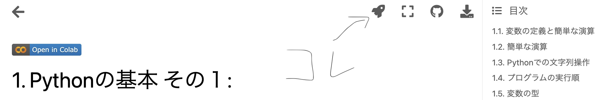

# 資料:実践データサイエンス

本コンテンツは宇都宮大学の基盤科目「実践データサイエンス」の授業資料です。

## 資料の使い方

本講義で用いる資料には幾つか種類(≒ファイル形式)がある。
慣れないうちは混同するかと思うので、ここに資料自体の説明と各種アプリケーションやサービスの説明をまとめておく。

### ブック
本資料は[Jupyter Notebook](https://github.com/jupyter/notebook)形式で作成されたソースファイルを[Jupyter Book](https://jupyterbook.org/en/stable/intro.html)を用いて変換することで作成されたコンテンツになっている。
授業内では**ブック**ないし"Book"と表記・呼称する。  

概要を理解したり復習する際にはこちらのブックを閲覧してください。

### ノートブック

[Jupyter Notebook](https://github.com/jupyter/notebook)とは、Markdownテキスト・数式・図などを含んだドキュメント作成とPythonなどのプログラミング実行環境とを提供する環境で、授業資料は`.ipynb`という拡張子のファイルとして作成されており、これを**ノートブック/Notebook**などと表記・呼称することにする。

またこれらのソースファイルの管理と共有には、GitHubと呼ばれる環境を利用している
(この授業を受講したりプログラムを実行するのに皆さんがGitHubのアカウントを取得したりする必要はありません)

Jupyter Notebookを編集・実行するための環境はいくつかあるが、本授業では環境構築やそれにかかるトラブルシューティングを最小化するために、Google Colaboratoryというサービスを利用して**Googleのクラウド環境上でJupyter Nootebookを編集・実行する方式**を採用する。

:::{note}
**授業に先立ってGoogleのアカウントの新規取得をお願いします!**
:::

**ブック**は概要をとらえたり復習をするときには見やすくて便利だが、実際に自身でコードを実行したりプログラムを書く場合には**Google Colaboratory上でJupyter Notebookを開く**ことになる。  
Google Colab.上でノートブックを開くには、各章の冒頭に用意された"Open in Colab"というボタンをクリックするか、上のロケットの形をしたボタンにマウスオーバーして"Colab"から開く。左の"Google Colaboratoryの使い方"や第1章のノートブックで試してみてください。下は参考画像:

##不具合報告または問い合わせ

本講義資料に関する不具合(リンク切れなど)の報告や、問い合わせについては下記のフォームより記載をお願いいたします。
授業受講者からの不具合報告・質問に関しては授業やCL等でお答えいたします。
それ以外の問い合わせについては、お答え出来ない場合もありますので予めご了承ください。

<iframe src="https://docs.google.com/forms/d/e/1FAIpQLSe9kSorMjkJPhbHqDWUwBNykaZ1yVDZ1eGl-5goFnNS-vQsQA/viewform?embedded=true" width="800" height="800" frameborder="0" marginheight="0" marginwidth="0">読み込んでいます…</iframe>